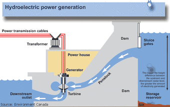
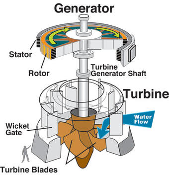
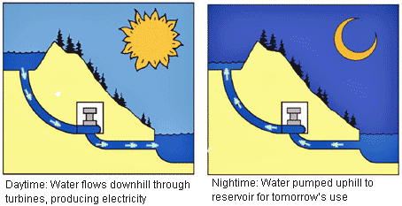

## PLTA
> Pembangkit Listrik Tenaga Air  
by: Bagas - Ericho - Fakhri - Rifki - Rizki

## Intro
Jadi bagaimana kita mendapatkan listrik dari air? Sebenarnya, pembangkit listrik tenaga air dan batu bara menghasilkan listrik dengan cara yang sama. Dalam kedua kasus, sumber daya digunakan untuk mengubah bagian seperti baling-baling yang disebut turbin.

## Here's the concept

## But, how ?
  
> "A hydraulic turbine converts the energy of flowing water into mechanical energy. A hydroelectric generator converts this mechanical energy into electricity. The operation of a generator is based on the principles discovered by Faraday. He found that when a magnet is moved past a conductor, it causes electricity to flow. In a large generator, electromagnets are made by circulating direct current through loops of wire wound around stacks of magnetic steel laminations. These are called field poles, and are mounted on the perimeter of the rotor. The rotor is attached to the turbine shaft, and rotates at a fixed speed. When the rotor turns, it causes the field poles (the electromagnets) to move past the conductors mounted in the stator. This, in turn, causes electricity to flow and a voltage to develop at the generator output terminals." - [usgs.gov](https://www.usgs.gov/special-topic/water-science-school/science/hydroelectric-power-how-it-works?qt-science_center_objects=0#qt-science_center_objects)

## Problem
Semakin banyak teknologi yang digunakan pada masa ini maka kebutuhan listrik akan meningkat juga, tetapi jika hanya mengandalkan PLTA atau Pembangkit Listrik lainnya bagaimana kebutuhan listrik kita bisa terpenuhi ? 

## Solution
> "Pumped storage: Reusing water for peak electricity demand"   

Pumped Storage atau Penyimpanan yang dipompa adalah metode menyimpan air dalam cadangan untuk kebutuhan daya periode puncak dengan memompa air yang telah mengalir melalui turbin, menyokong kolam penyimpanan di atas pembangkit listrik pada saat permintaan energi oleh pelanggan rendah, seperti selama pertengahan malam ini.   

Air kemudian dibiarkan mengalir kembali melalui generator turbin pada saat permintaan tinggi dan beban berat ditempatkan pada sistem.

## Solution (2nd part)

The reservoir acts much like a battery, storing power in the form of water when demands are low and producing maximum power during daily and seasonal peak periods.   

An advantage of pumped storage is that hydroelectric generating units are able to start up quickly and make rapid adjustments in output. They operate efficiently when used for one hour or several hours. Because pumped storage reservoirs are relatively small, construction costs are generally low compared with conventional hydropower facilities.

## Summary
Jadi, 

## Thanks
